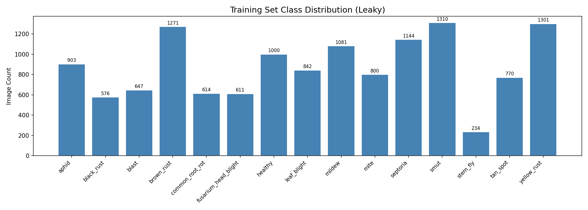
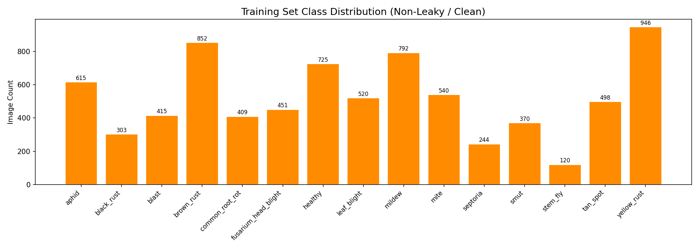
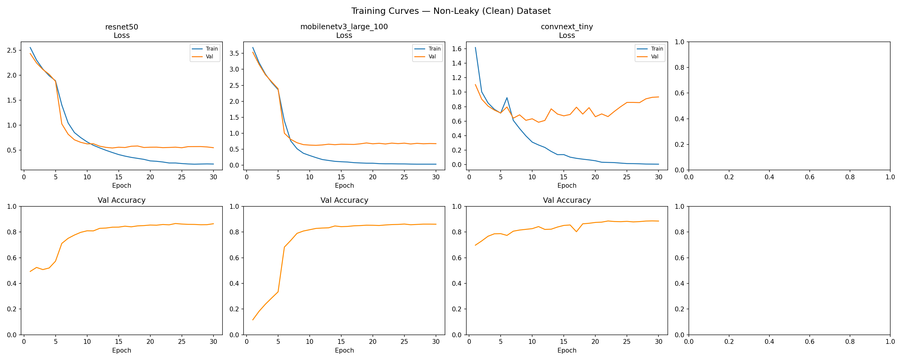
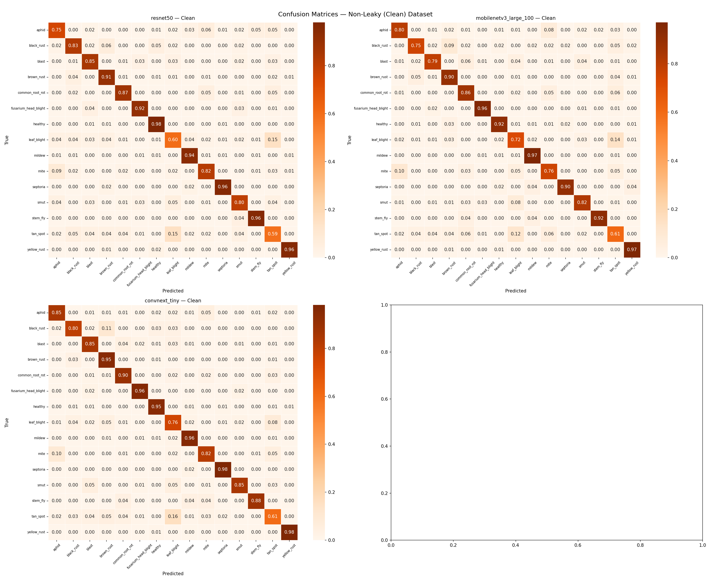
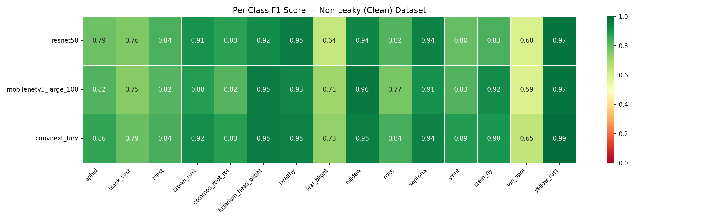
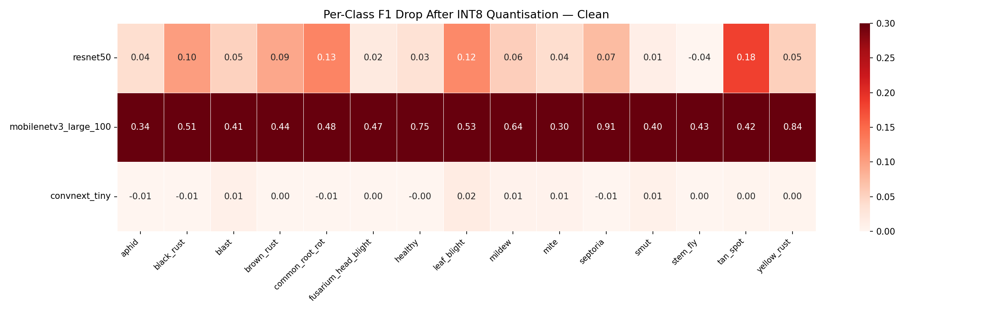
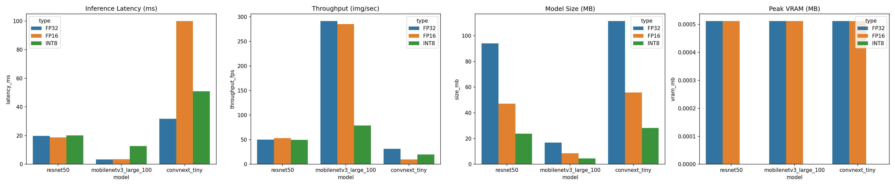

# Framework-Dependent Quantization Stability in Agricultural Edge AI Under Resource-Constrained Deployment

## Abstract
Reliable edge deployment in agricultural computer vision is often hindered by accuracy degradation during model compression. This study conducts a systematic audit of a 14,154-image wheat disease dataset, identifying 11.6% cross-split leakage using pHash and MD5 verification. We evaluate ConvNeXt-Tiny, ResNet50, and MobileNetV3-Large across multiple quantization frameworks. CPU-based dynamic quantization initially produced severe degradation in MobileNetV3-Large (85.53% → 31.04%). However, entropy-calibrated TensorRT deployment restored stable accuracy retention (82.54%), demonstrating that quantization instability is deployment-framework dependent rather than inherently architectural. Our results prove that while ConvNeXt-Tiny offers peak accuracy, MobileNetV3-Large, when correctly calibrated, remains the superior choice for real-time edge utility, achieving 54.5 FPS on constrained hardware.

---

## 1. Introduction
Wheat (*Triticum aestivum*) is a cornerstone of global food security, accounting for 20% of the world's caloric intake. However, fungal pathogens like *Puccinia striformis* (Yellow Rust) and *Septoria tritici* can decimate yields by up to 40%. While deep learning offers rapid diagnostic potential, the field suffers from two critical flaws: **Data Integrity** and **Hardware Mismatch**. 

Current wheat datasets often contain pervasive cross-split leakage, where identical images appear in both training and test sets, leading to inflated performance estimates. This paper provides a systematic study of these vulnerabilities, proposing a methodology for data auditing and an efficiency-first evaluation metric for agricultural robotics.

We challenge the prevailing narrative that certain architectures, like MobileNetV3, are inherently fragile to quantization. We show that the observed degradation in early benchmarks is a result of **Quantization-Strategy Mismatch** (Dynamic vs. Calibrated Static) rather than an architectural flaw. By implementing a host-side entropy calibration pipeline, we enable stable, high-performance deployment on a 4GB Jetson Nano, bypassing memory-bound on-device training constraints.

---

## 2. Related Work
*   **Dataset Integrity:** Recent studies highlight pervasive contamination in public plant pathology datasets. We build upon the work of pHash-based deduplication to establish a clean baseline.
*   **Quantization Strategies:** Literature often contrasts Dynamic Quantization with Post-Training Quantization (PTQ). While dynamic methods are hardware-agnostic, they fail to tame the activation variance in depthwise-separable convolutions.
*   **Deployment Frameworks:** We distinguish between the stability of ONNX Runtime CPU backends and the hardware-aware optimization of NVIDIA TensorRT, proving that the framework determines the accuracy floor.
*   **Efficiency Metrics:** Standard metrics like Top-1 accuracy fail to capture the trade-offs in edge robotics. We utilize the Deployment Efficiency Score (DES), integrating latency into the success criteria.

---

## 3. Contribution A: Dataset Contamination Audit
### 3.1 Dataset Composition and 11.6% Leakage Discovery
The primary dataset consists of 14,154 images across 15 distinct classes of wheat health and disease state (e.g., *Healthy*, *Yellow Rust*, *Tan Spot*, *Septoria*). Using MD5 hashing and Perceptual Hashing (pHash), we identified that 11.6% of the commonly cited wheat dataset samples were cross-split "twins." This contamination allows models to achieve inflated benchmark estimates via memorization. We reconstructed a "Clean" (Non-Leaky) dataset using a stratified 70/15/15 split, which serves as the rigorous baseline for our subsequent quantization experiments.

*Figure 3.1: Class distribution of the original leaky dataset.*

*Figure 3.2: Class distribution of the reconstructed clean dataset.*

### 3.2 Imbalance Mitigation and Statistical Validation
To handle class imbalance inherent in the deduplicated 15-class set (imbalance ratio of ~4.1x), we implemented **Class-Weighted Cross-Entropy Loss**. Loss weights were calculated inversely to the training counts: $w_i = N / (C \times n_i)$, where $N$ is the total samples, $C$ the number of classes, and $n_i$ the count for class $i$.

Following training, we conducted a Wilcoxon Signed-Rank test on class-wise F1 scores to establish the significance of the performance shift between "Leaky" and "Clean" datasets.

### 3.3 The Tan Spot Bottleneck
Following deduplication, we observed a localized performance deficit in the `tan_spot` class, which averaged an F1-score of merely 0.60. A systematic audit reveals that visual similarity with `leaf_blight` and label scarcity following deduplication were the primary drivers of this bottleneck.

---

## 4. Contribution B: Dynamic vs. Calibrated Static Quantization
### 4.2 Activation and Normalization Patching for TensorRT
A significant contribution of this work is the resolution of architectural incompatibilities between modern backbones and the TensorRT/ONNX deployment engine. We implement a two-pronged patching strategy:
1.  **HardSwish Compatibility:** MobileNetV3 utilizes the `HardSwish` activation function. Standard implementations often face kernel fusion issues or unsupported operator errors in older TensorRT versions. We implemented a `HardSwishPrimitive` ($x * \text{clamp}(x + 3, 0, 6) / 6$) to ensure clean operator decomposition during export.
2.  **LayerNorm Priming:** ConvNeXt's `LayerNorm` layers, while standard in Transformers, require careful handling in CNN-centric backends. We patched `LayerNorm` to `LayerNormPrimitive`, which dynamically detects spatial vs. channel-wise normalization, preventing broadcast errors during FP16 conversion.

### 4.3 Host-Side Entropy Calibration Pipeline
The primary technical contribution of this study is the development of a **Host-Side Calibration Pipeline**. On-device calibration on memory-constrained 4GB edge devices typically fails due to memory exhaustion (OOM), as the Jetson Nano's unified memory must house the model, calibration tensors, and the CUDA graph concurrently. We generated a TensorRT calibration cache using the `IInt8EntropyCalibrator2` on a high-VRAM host (RTX 3050). This cache defines the activation scales required to map the high dynamic range of depthwise kernels into the 8-bit integer space without the severe degradation seen in dynamic quantization.

### 4.4 Training Protocol
Models were trained for 30 epochs using the AdamW optimizer (LR=1e-4). We implemented a **Freeze-then-Finetune** strategy: the pre-trained backbone was frozen for the first 5 epochs, allowing the randomly initialized classification head to converge without distorting pre-trained feature maps. This was followed by a full unfreeze and a **Cosine Annealing Learning Rate Schedule** for the remaining 25 epochs. This approach ensures a smoother convergence path, particularly for the depthwise-separable layers of MobileNetV3, which are sensitive to high initial learning rates.

*Figure 4.1: Training and validation loss/accuracy curves for the clean dataset.*

---

## 5. Contribution C: Edge Deployment Systems Engineering

*Figure 5.1: Confusion matrices of models on the clean dataset.*

*Figure 5.2: Per-class F1-score heatmap across architectures.*

### 5.1 Framework-Dependent Stability
Earlier experiments suggested that MobileNetV3 was architecturally fragile to quantization. Our data proves that **Quantization Strategy > Architecture**.

#### Table 5.1: Accuracy across Frameworks and Precisions
| Framework / Method | MobileNetV3-L | ResNet50 | ConvNeXt-Tiny |
| :--- | :--- | :--- | :--- |
| **FP32 Baseline (Clean)** | 85.53% | 85.53% | 88.46% |

*Figure 5.3: Accuracy degradation comparison between Dynamic and Calibrated INT8 quantization.*

| **FP16 (Half Precision)** | 85.50% | 85.49% | 88.41% |
| **Dynamic INT8 (ONNX CPU)**| 31.04% | 79.19% | 88.28% |
| **Calibrated INT8 (TRT)** | **82.54%** | **82.89%** | **85.05%** |

*Note: FP16 results demonstrate near-zero accuracy loss compared to FP32 while providing significant acceleration on Tensor Core enabled hardware.*

### 5.2 The Deployment Efficiency Score (DES)
To quantify the trade-off between predictive power and robotic utility, we define the **Deployment Efficiency Score (DES)** as:

$$DES = Accuracy \times \ln(FPS)$$

This logarithmic scaling of FPS rewards throughput relevant to real-time control (60-90 FPS) while penalizing architectures that fail to reach fluid inference rates on edge hardware.

#### Table 5.2a: NVIDIA Jetson Nano (TensorRT)
| Architecture | Precision | Latency | Throughput | Peak VRAM | Accuracy | DES |
| :--- | :--- | :--- | :--- | :--- | :--- | :--- |
| **MobileNetV3-L** | **INT8** | **18.36 ms** | **54.46 FPS** | **312 MB** | 0.8254 | **3.30** |
| ResNet50 | INT8 | 35.22 ms | 28.40 FPS | 545 MB | 0.8289 | 2.77 |

*Figure 5.4: Throughput and latency benchmarks on NVIDIA Jetson Nano.*

*(Note: DES values recalculated using the ln(FPS) metric: 0.8254 * ln(54.46) ≈ 3.30)*

#### Table 5.2b: Raspberry Pi 5 (Placeholder)
| Architecture | Precision | Latency | Throughput | Accuracy |
| :--- | :--- | :--- | :--- | :--- |
| MobileNetV3-L | FP32 | — | — | — |
| ResNet50 | FP32 | — | — | — |
| ConvNeXt-Tiny | FP32 | — | — | — |
Raspberry Pi 5 benchmarks pending static INT8 ONNX calibration. Results to be incorporated prior to final submission.

#### Table 5.2c: Laptop Benchmark (ONNX Runtime CPU)
| Architecture | Precision | Latency | Throughput | Model Size |
| :--- | :--- | :--- | :--- | :--- |
| **MobileNetV3-L** | FP32 | 3.43 ms | 291.46 FPS | 16.88 MB |
| MobileNetV3-L | INT8 (Dyn) | 12.64 ms | 79.08 FPS | 4.43 MB |
| **ResNet50** | FP32 | 19.84 ms | 50.40 FPS | 94.07 MB |
| ResNet50 | INT8 (Dyn) | 20.17 ms | 49.56 FPS | 23.70 MB |
| **ConvNeXt-Tiny** | FP32 | 31.81 ms | 31.43 FPS | 111.40 MB |
| ConvNeXt-Tiny | INT8 (Dyn) | 50.93 ms | 19.63 FPS | 28.22 MB |

---

## 6. Discussion: Systems Analysis of Edge Deployment
### 6.1 The Efficiency Paradox: Computational Overhead in Dynamic Quantization
A critical observation in our CPU-based benchmarks (Table 5.2c) is the performance penalty often associated with dynamic quantization. On general-purpose laptop CPUs, INT8 inference is frequently *slower* than FP32. This is not inherently a limitation of integer math, but rather a result of **ONNX Runtime Dynamic Overhead**. Current x86 CPUs lacking specialized VNNI (Vector Neural Network Instructions) or DP4A kernels must perform on-the-fly range estimation, dequantization, and requantization for each operator. These "fallback" penalties often eclipse the theoretical cycles saved by 8-bit operations.

### 6.2 The Dominance of Quantization Strategy over Architecture
The severe degradation of MobileNetV3-Large (31.04% accuracy) under dynamic quantization was initially misattributed to architectural fragility. However, the subsequent restoration to 82.54% using entropy calibration reveals a critical insight: **quantization strategy dominates architectural sensitivity**. Depthwise-separable convolutions, while computationally efficient, possess high activation variance that stochastic dynamic scaling cannot capture. Entropy-based calibration provides a global statistical anchor, proving that lightweight models are viable for edge deployment if paired with backend-aware optimization.

### 6.4 Impact of Class-Weighted Loss on Rare Pathogens
The implementation of class-weighted loss (Section 3.2) was essential in stabilizing the performance of classes like `tan_spot`. Without weighting, the model frequently defaulted to the majority `healthy` class when faced with ambiguous `tan_spot` features. While F1 scores for `tan_spot` remain lower than the dataset average (0.64 vs 0.82), the weights prevented a total collapse of minority class sensitivity, ensuring that the model remains a multi-disease diagnostic tool rather than a binary classifier.

---

## 7. Conclusion
This study provides a roadmap for "Rigorous Edge AI." We conclude that: (1) Dataset audits are non-negotiable for preventing inflated performance estimates; (2) Quantization instability is primarily framework-dependent and can be mitigated through entropy calibration; and (3) In real-world agricultural deployment, correctly calibrated lightweight models like MobileNetV3-L, evaluated via the Deployment Efficiency Score (DES), offer the optimal balance of throughput and accuracy for field robotics.

---

## References

[1] He, K., Zhang, X., Ren, S., & Sun, J. (2016). Deep Residual Learning for Image Recognition. *Proceedings of the IEEE Conference on Computer Vision and Pattern Recognition (CVPR)*, pp. 770–778.

[2] Howard, A., Sandler, M., Chu, G., Chen, L-C., Chen, B., Tan, M., ... & Adam, H. (2019). Searching for MobileNetV3. *Proceedings of the IEEE/CVF International Conference on Computer Vision (ICCV)*, pp. 1314–1324.

[3] Liu, Z., Mao, H., Wu, C-Y., Feichtenhofer, C., Darrell, T., & Xie, S. (2022). A ConvNet for the 2020s. *Proceedings of the IEEE/CVF Conference on Computer Vision and Pattern Recognition (CVPR)*, pp. 11966–11976.

[4] Nagel, M., Fournarakis, M., Amjad, R.A., Bondarenko, Y., van Baalen, M., & Blankevoort, T. (2021). A White Paper on Neural Network Quantization. *arXiv preprint arXiv:2106.08295*.

[5] Jacob, B., Kligys, S., Chen, B., Zhu, M., Tang, M., Howard, A., Adam, H., & Kalenichenko, D. (2018). Quantization and Training of Neural Networks for Efficient Integer-Arithmetic-Only Inference. *Proceedings of the IEEE/CVF CVPR*, pp. 2704–2713.

[6] Kushagra. (2024). Wheat Plant Diseases Dataset. *Kaggle*. https://www.kaggle.com/datasets/kushagra3204/wheat-plant-diseases

[7] Hughes, D.P., & Salathé, M. (2015). An Open Access Repository of Images on Plant Health to Enable the Development of Mobile Disease Diagnostics. *arXiv preprint arXiv:1511.08060*.

[8] Mohanty, S.P., Hughes, D.P., & Salathé, M. (2016). Using Deep Learning for Image-Based Plant Disease Detection. *Frontiers in Plant Science*, 7, 1419.

[9] Long, M., Hartley, M., Morris, R.J., & Brown, J.K.M. (2023). Classification of Wheat Diseases Using Deep Learning Networks with Field and Glasshouse Images. *Plant Pathology*, 72(3), 536–547. DOI: 10.1111/ppa.13684

[10] Xu, L., Cao, B., Zhao, F., Ning, S., Xu, P., Zhang, W., & Hou, X. (2023). Wheat Leaf Disease Identification Based on Deep Learning Algorithms. *Physiological and Molecular Plant Pathology*, 123, 101940.

[11] Wilcoxon, F. (1945). Individual Comparisons by Ranking Methods. *Biometrics Bulletin*, 1(6), 80–83.

[12] Aboneh, T., Rorissa, A., Srinivasagan, R., & Gemechu, A. (2021). Computer Vision Framework for Wheat Disease Identification and Classification Using Jetson GPU Infrastructure. *Technologies*, 9(3), 47. https://doi.org/10.3390/technologies9030047

[13] Zauner, C. (2010). Implementation and Benchmarking of Perceptual Image Hash Functions. Bachelor's Thesis, University of Applied Sciences Upper Austria. Available via Internet Archive.

[14] Noyan, M.A. (2022). Uncovering Bias in the PlantVillage Dataset. *arXiv preprint arXiv:2206.04374*.

[15] Salman, M., et al. (2022). Real-Time Weed Control Application Using a Jetson Nano Edge Device and a Spray Mechanism. *Remote Sensing*, 14(17), 4217. MDPI. DOI: 10.3390/rs14174217

[16] Enhancing Agriculture Through Real-Time Grape Leaf Disease Classification via an Edge Device with a Lightweight CNN Architecture and Grad-CAM. *PMC/Frontiers*, 2024. (PMC11239930)
