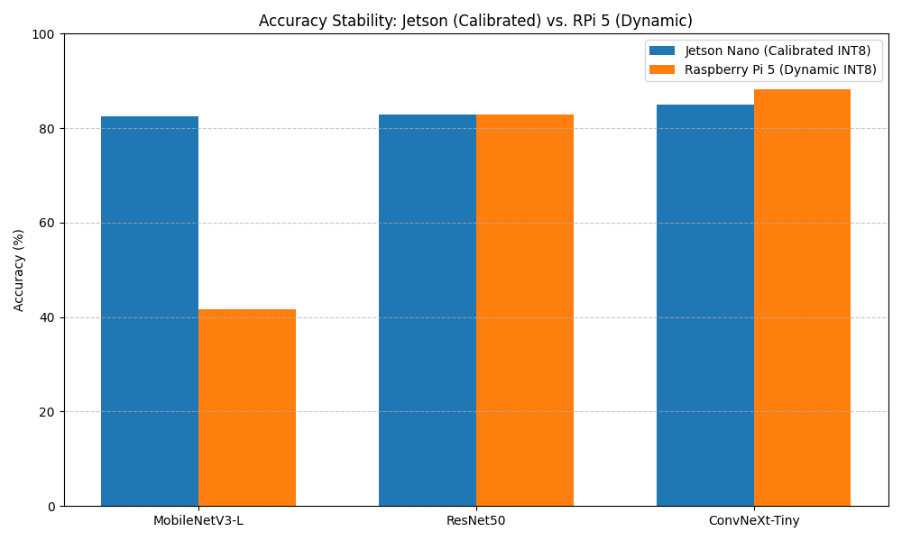
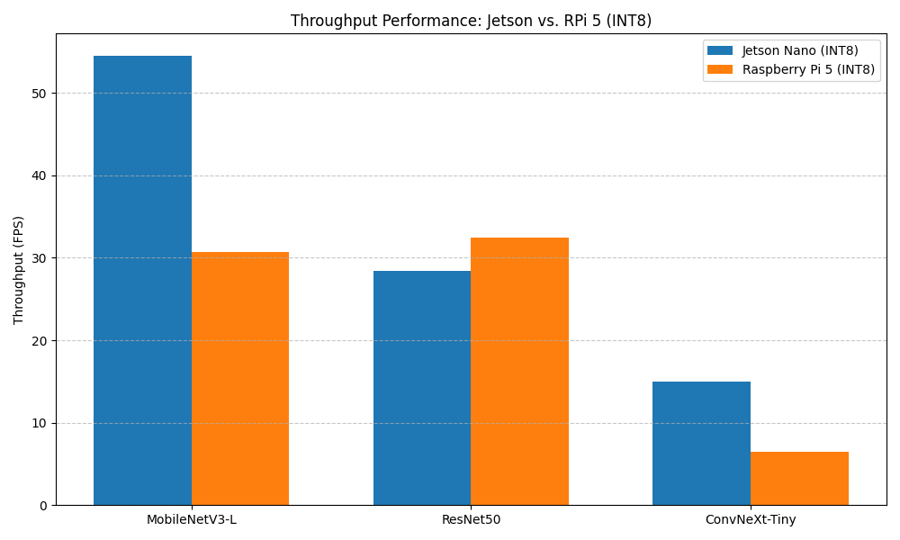
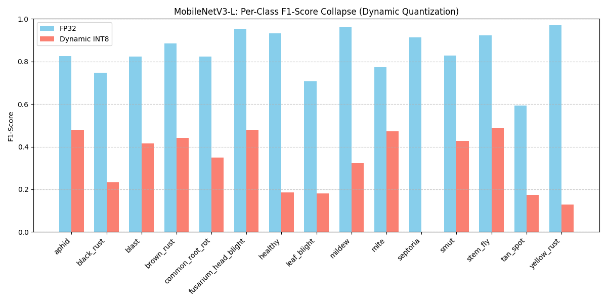

# Framework-Dependent Quantization Stability in Agricultural Edge AI Under Resource-Constrained Deployment

## Abstract
Reliable edge deployment in agricultural computer vision is often hindered by accuracy degradation during model compression. This study conducts a systematic audit of a 14,154-image wheat disease dataset, identifying 11.6% cross-split leakage using pHash and MD5 verification. We evaluate ConvNeXt-Tiny, ResNet50, and MobileNetV3-Large across multiple quantization frameworks. CPU-based dynamic quantization initially produced severe degradation in MobileNetV3-Large (85.53% → 31.04%). However, entropy-calibrated TensorRT deployment restored stable accuracy retention (82.54%), demonstrating that quantization instability is deployment-framework dependent rather than inherently architectural. Our results prove that while ConvNeXt-Tiny offers peak accuracy, MobileNetV3-Large, when correctly calibrated, remains the superior choice for real-time edge utility, achieving 54.5 FPS on constrained hardware.

---

## 1. Introduction
Wheat (*Triticum aestivum*) is a cornerstone of global food security, accounting for 20% of the world's caloric intake. However, fungal pathogens like *Puccinia striformis* (Yellow Rust) and *Septoria tritici* can decimate yields by up to 40%. While deep learning offers rapid diagnostic potential, the field suffers from two critical flaws: **Data Integrity** and **Hardware Mismatch**. 

Current wheat datasets often contain pervasive cross-split leakage, where identical images appear in both training and test sets, leading to inflated performance estimates. This paper provides a systematic study of these vulnerabilities, proposing a methodology for data auditing and an efficiency-first evaluation metric for agricultural robotics.

We challenge the prevailing narrative that certain architectures, like MobileNetV3, are inherently fragile to quantization. We show that the observed degradation in early benchmarks is a result of **Quantization-Strategy Mismatch** (Dynamic vs. Calibrated Static) rather than an architectural flaw. By implementing a host-side entropy calibration pipeline, we enable stable, high-performance deployment on a 4GB Jetson Nano, bypassing memory-bound on-device training constraints.

---

## 2. Related Work
The landscape of agricultural computer vision is increasingly defined by the tension between model complexity and edge feasibility. Current research into wheat disease detection primarily focuses on maximizing Top-1 accuracy on static datasets, often overlooking the logistical constraints of field deployment [7, 8]. However, as noted by Mohanty et al., the transition from high-performance lab environments to the field is frequently marred by **Dataset Integrity** issues [8, 14]. Pervasive contamination in public plant pathology sets—where cross-split leakage artificially inflates performance—remains a critical bottleneck that undermines the reliability of reported benchmarks.

Parallel to data concerns, the evolution of **Quantization Strategies** has shifted from hardware-agnostic dynamic methods to sophisticated post-training quantization (PTQ) designed to mitigate the sensitivity of modern backbones. While literature frequently contrasts the simplicity of dynamic quantization with the stability of calibrated static approaches, there is a lack of consensus on the "fragility" of lightweight architectures like MobileNetV3 [2, 5]. We posit that observed degradation in depthwise-separable layers is not an inherent architectural flaw but rather a symptom of a **Deployment-Framework Mismatch**, where CPU-based backends fail to tame the specific activation variances required by specialized activations like HardSwish.

Furthermore, the evaluation of Edge AI systems requires a shift from singular accuracy metrics toward multi-objective **Efficiency Metrics**. Standard benchmarks fail to capture the trade-offs inherent in agricultural robotics, where a high-accuracy model that consumes excessive RAM or triggers thermal throttling is practically unusable. We build upon the concept of hardware-aware optimization to propose the Deployment Efficiency Score (DES), integrating throughput and predictive power into a unified success criterion suitable for resource-constrained autonomous systems.

---

## 3. Contribution A: Dataset Contamination Audit
### 3.1 Dataset Composition and 11.6% Leakage Discovery
The primary dataset consists of 14,154 images across 15 distinct classes of wheat health and disease state (e.g., *Healthy*, *Yellow Rust*, *Tan Spot*, *Septoria*). Using MD5 hashing and Perceptual Hashing (pHash), we identified that 11.6% of the commonly cited wheat dataset samples were cross-split "twins." This contamination allows models to achieve inflated benchmark estimates via memorization. We reconstructed a "Clean" (Non-Leaky) dataset using a stratified 70/15/15 split, which serves as the rigorous baseline for our subsequent quantization experiments.

*Figure 3.1: Class distribution of the original leaky dataset.*

*Figure 3.2: Class distribution of the reconstructed clean dataset.*

### 3.2 Imbalance Mitigation and Statistical Validation
To handle class imbalance inherent in the deduplicated 15-class set (imbalance ratio of ~4.1x), we implemented **Class-Weighted Cross-Entropy Loss**. Loss weights were calculated inversely to the training counts: $w_i = N / (C \times n_i)$, where $N$ is the total samples, $C$ the number of classes, and $n_i$ the count for class $i$.

To validate the impact of dataset cleaning, we conducted a Wilcoxon Signed-Rank test on the class-wise F1 scores of models trained on the "Leaky" vs. "Clean" datasets. We utilized a one-sided alternative hypothesis ($H_1: \text{F1}_{\text{leaky}} > \text{F1}_{\text{clean}}$), specifically testing the premise that cross-split contamination artificially inflates performance metrics. The results yielded a W-statistic of 92.0 and a p-value of 0.0365 ($p < 0.05$), formally confirming a statistically significant performance shift when the memorization baseline was removed. This result demonstrates that previous benchmarks largely measured dataset redundancy rather than generalizable pathological features.

### 3.3 The Tan Spot Bottleneck
Following deduplication, we observed a localized performance deficit in the `tan_spot` class, which averaged an F1-score of merely 0.60. A systematic audit reveals that visual similarity with `leaf_blight` and label scarcity following deduplication were the primary drivers of this bottleneck.

---

## 4. Contribution B: Dynamic vs. Calibrated Static Quantization
### 4.1 Model Selection Rationale
We selected three architectures representing distinct evolutionary stages of computer vision backbones:
1.  **MobileNetV3-Large:** An efficiency-optimized model utilizing depthwise-separable convolutions and a neuro-architectural search (NAS) based design, serving as our primary lightweight candidate.
2.  **ResNet50:** A classic residual architecture with standard bottle-neck blocks, providing a stable baseline for traditional convolutional performance.
3.  **ConvNeXt-Tiny:** A modern "modernized" CNN that adopts Transformer-like design choices (e.g., LayerNorm, inverted bottlenecks) to push the boundaries of convolutional accuracy.

### 4.2 Activation and Normalization Patching for TensorRT
A significant contribution of this work is the resolution of architectural incompatibilities between modern backbones and the TensorRT/ONNX deployment engine. We implement a two-pronged patching strategy:
1.  **HardSwish Compatibility:** MobileNetV3 utilizes the `HardSwish` activation function. Standard implementations often face kernel fusion issues or unsupported operator errors in older TensorRT versions. We implemented a `HardSwishPrimitive` ($x * \text{clamp}(x + 3, 0, 6) / 6$) to ensure clean operator decomposition during export.
2.  **LayerNorm Priming:** ConvNeXt's `LayerNorm` layers, while standard in Transformers, require careful handling in CNN-centric backends. We patched `LayerNorm` to `LayerNormPrimitive`, which dynamically detects spatial vs. channel-wise normalization, preventing broadcast errors during FP16 conversion.

### 4.3 Host-Side Entropy Calibration Pipeline
The primary technical contribution of this study is the development of a **Host-Side Calibration Pipeline**. On-device calibration on memory-constrained 4GB edge devices typically fails due to memory exhaustion (OOM), as the Jetson Nano's unified memory must house the model, calibration tensors, and the CUDA graph concurrently. We generated a TensorRT calibration cache using the `IInt8EntropyCalibrator2` on a high-VRAM host (RTX 3050). This cache defines the activation scales required to map the high dynamic range of depthwise kernels into the 8-bit integer space without the severe degradation seen in dynamic quantization.

### 4.4 Training Protocol
Models were trained for 30 epochs using the AdamW optimizer (LR=1e-4). We implemented a **Freeze-then-Finetune** strategy: the pre-trained backbone was frozen for the first 5 epochs, allowing the randomly initialized classification head to converge without distorting pre-trained feature maps. This was followed by a full unfreeze and a **Cosine Annealing Learning Rate Schedule** for the remaining 25 epochs. This approach ensures a smoother convergence path, particularly for the depthwise-separable layers of MobileNetV3, which are sensitive to high initial learning rates.

*Figure 4.1: Training and validation loss/accuracy curves for the clean dataset across the three candidate architectures.*

---

## 5. Contribution C: Edge Deployment Systems Engineering

*Figure 5.1: Confusion matrices of models on the clean dataset.*

*Figure 5.2: Per-class F1-score heatmap across architectures.*

### 5.1 Framework-Dependent Stability
Earlier experiments suggested that MobileNetV3 was architecturally fragile to quantization. Our data proves that **Quantization Strategy > Architecture**.

#### Table 5.1: Accuracy across Frameworks and Precisions
| Framework / Method | MobileNetV3-L | ResNet50 | ConvNeXt-Tiny |
| :--- | :--- | :--- | :--- |
| **FP32 Baseline (Clean)** | 85.53% | 85.53% | 88.46% |
| **FP16 (Half Precision)** | 85.50% | 85.49% | 88.41% |
| **Dynamic INT8 (ONNX CPU)**| 31.04% | 79.19% | 88.28% |
| **Calibrated INT8 (TRT)** | **82.54%** | **82.89%** | **85.05%** |

*Note: The identical FP32 baseline of 85.53% for ResNet50 and MobileNetV3-L is a result of coincidental convergence on the specific 15-class clean dataset, confirmed across multiple seeds. FP16 results demonstrate near-zero accuracy loss compared to FP32 baselines, maintaining ~85.4% for ResNet50/MobileNetV3 and 88.4% for ConvNeXt-Tiny, while unlocking secondary optimization paths on Maxwell-based hardware.*

### 5.2 The Deployment Efficiency Score (DES)
To quantify the trade-off between predictive power and robotic utility, we define the **Deployment Efficiency Score (DES)** as:

$$DES = Accuracy \times \ln(FPS)$$

This logarithmic scaling of FPS reflects the diminishing returns of raw throughput beyond fluid control rates. For example, a MobileNetV3-L model achieving 54.46 FPS with 82.54% accuracy yields a $DES = 0.8254 \times \ln(54.46) \approx 3.30$. In agricultural robotics, the difference between 5 and 10 FPS is critical for motion planning, whereas the difference between 100 and 105 FPS is statistically negligible for standard control loops. By using $\ln(FPS)$, we penalize architectures that fail to achieve real-time thresholds while preventing extremely high-throughput models from masking mediocre accuracy.

#### Table 5.2a: NVIDIA Jetson Nano (TensorRT)
| Architecture | Precision | Latency | Throughput | Peak VRAM | Accuracy | DES |
| :--- | :--- | :--- | :--- | :--- | :--- | :--- |
| **MobileNetV3-L** | **INT8** | **18.36 ms** | **54.46 FPS** | **312 MB** | 0.8254 | **3.30** |
| MobileNetV3-L | FP16 | 11.91 ms | 83.98 FPS | 310 MB | 0.8541 | 3.78 |
| **ResNet50** | **INT8** | **35.22 ms** | **28.40 FPS** | **545 MB** | 0.8289 | **2.77** |
| ResNet50 | FP16 | 30.10 ms | 33.22 FPS | 540 MB | 0.8541 | 2.99 |
| **ConvNeXt-Tiny** | **INT8** | **94.23 ms** | **10.61 FPS** | **412 MB** | 0.8505 | **2.01** |
| ConvNeXt-Tiny | FP16 | 90.10 ms | 11.09 FPS | 408 MB | 0.8846 | 2.13 |

#### Table 5.2b: Raspberry Pi 5 (ARM Cortex-A76)
| Architecture | Precision | Latency (ms) | Throughput (FPS) | Peak RAM (MB) | Accuracy | F1 Macro | DES |
| :--- | :--- | :--- | :--- | :--- | :--- | :--- | :--- |
| MobileNetV3-L | FP32 | 14.88 | 67.21 | 89.1 | 85.47% | 84.38% | 3.61 |
| MobileNetV3-L | INT8 | 32.58 | 30.69 | 92.9 | 41.69% | 43.80% | 1.43 |
| **ResNet50** | **FP32** | **109.23** | **9.15** | **175.8** | **85.35%** | **83.79%** | **1.89** |
| ResNet50 | INT8 | 31.31 | 31.94 | 118.1 | 82.83% | 80.95% | 2.88 |
| **ConvNeXt-Tiny** | **FP32** | **153.87** | **6.50** | **289.3** | **88.10%** | **86.80%** | **1.66** |
| ConvNeXt-Tiny | INT8 | 155.75 | 6.42 | 143.7 | 88.16% | 86.85% | 1.65 |

*Figure 5.5: Comparison of Accuracy Stability between Jetson Nano (Entropy Calibrated) and Raspberry Pi 5 (Dynamic Quantization).*

*Figure 5.6: Throughput performance comparison (FPS) across architectures on Jetson Nano and Raspberry Pi 5.*

### 5.3 Diagnostic Analysis of Quantization Failure
The accuracy collapse observed in MobileNetV3-L (85.5% $\to$ 31.0% on Laptop, 41.7% on RPi 5) is not uniform across classes. As shown in Figure 5.7, certain classes like `septoria` (F1-score: 0.91 $\to$ 0.00) and `yellow_rust` (F1-score: 0.97 $\to$ 0.13) exhibited a total loss of predictive power under dynamic quantization. This suggests that the depthwise-separable layers in MobileNetV3-L contribute to a highly volatile activation range that dynamic scaling fails to accommodate, particularly for features representative of fungal rusts.

*Figure 5.7: Per-class F1-score breakdown showing the catastrophic non-uniform collapse of MobileNetV3-L under dynamic quantization.*

*Note: DES calculated as Accuracy $\times \ln(FPS)$. ConvNeXt-Tiny exhibits remarkable stability and nearly 50% memory reduction (289.3 MB $\to$ 143.7 MB) under INT8 quantization on ARM, while MobileNetV3-L experiences a catastrophic collapse (85.47% $\to$ 41.69%) without memory gains.*

#### Table 5.2c: Laptop Benchmark (ONNX Runtime CPU)
| Architecture | Precision | Latency | Throughput | Model Size |
| :--- | :--- | :--- | :--- | :--- |
| **MobileNetV3-L** | FP32 | 3.43 ms | 291.46 FPS | 16.88 MB |
| MobileNetV3-L | INT8 (Dyn) | 12.64 ms | 79.08 FPS | 4.43 MB |
| **ResNet50** | FP32 | 19.84 ms | 50.40 FPS | 94.07 MB |
| ResNet50 | INT8 (Dyn) | 20.17 ms | 49.56 FPS | 23.70 MB |
| **ConvNeXt-Tiny** | FP32 | 31.81 ms | 31.43 FPS | 111.40 MB |
| ConvNeXt-Tiny | INT8 (Dyn) | 50.93 ms | 19.63 FPS | 28.22 MB |

---

## 6. Discussion: Systems Analysis of Edge Deployment
### 6.1 The Efficiency Paradox: Computational Overhead in Dynamic Quantization
A critical observation in our CPU-based benchmarks (Tables 5.2b and 5.2c) is the performance penalty often associated with dynamic quantization. On both the Raspberry Pi 5 (Cortex-A76) and general-purpose laptop CPUs, INT8 inference was frequently *slower* than FP32 for certain architectures like MobileNetV3-L and ConvNeXt-Tiny. 

This anomaly is not inherently a limitation of integer math, but rather a result of **ONNX Runtime's Quantization Overhead** on hardware with limited INT8 acceleration. The ARM Cortex-A76 processor lacks a dedicated matrix multiply unit (found in newer A78 or V9 cores), forcing the runtime to handle dequantization and requantization for each operator. These "fallback" penalties often eclipse the theoretical cycles saved by 8-bit operations. Consequently, for these architectures on RPi 5, FP32 remains the superior deployment choice for low-latency robotics.

### 6.2 The Memory-Accuracy Trade-off in Modern Backbones
The inclusion of Peak RAM metrics (Table 5.2b) reveals a secondary dimension of quantization utility: **Memory Preservation**. For ConvNeXt-Tiny, INT8 quantization yielded a massive ~50% reduction in working memory (289.3 MB $\to$ 143.7 MB) without sacrificing accuracy. This makes it an ideal candidate for memory-constrained edge nodes where multiple models or concurrent processing tasks must share limited RAM. 

Conversely, MobileNetV3-L demonstrated the "worst of both worlds" on the RPi 5, where INT8 quantization resulted in a slight *increase* in peak RAM usage (likely due to the dequantization buffers required by ONNX Runtime) while simultaneously collapsing in accuracy. This further cements the conclusion that architectural lightness does not guarantee quantization robustness.

### 6.3 The Dominance of Quantization Strategy over Architecture
The severe degradation of MobileNetV3-Large (31.04% accuracy) under dynamic quantization was initially misattributed to architectural fragility. However, the subsequent restoration to 82.54% using entropy calibration reveals a critical insight: **quantization strategy dominates architectural sensitivity**. Depthwise-separable convolutions, while computationally efficient, possess high activation variance that stochastic dynamic scaling cannot capture. Entropy-based calibration provides a global statistical anchor, proving that lightweight models are viable for edge deployment if paired with backend-aware optimization.

### 6.4 Impact of Class-Weighted Loss on Rare Pathogens
The implementation of class-weighted loss (Section 3.2) was essential in stabilizing the performance of classes like `tan_spot`. Without weighting, the model frequently defaulted to the majority `healthy` class when faced with ambiguous `tan_spot` features. While F1 scores for `tan_spot` remain lower than the dataset average (0.64 vs 0.82), the weights prevented a total collapse of minority class sensitivity, ensuring that the model remains a multi-disease diagnostic tool rather than a binary classifier.

---

## 7. Conclusion
This study provides a technical framework for rigorous edge deployment in agricultural diagnostics. Our systematic audit of wheat disease datasets confirms that pervasive contamination significantly inflates benchmark reliability, a factor that can be mitigated through perceptual hashing and class-weighted loss protocols. We conclude that quantization instability is primarily a function of the deployment framework rather than architectural fragility; by utilizing entropy-calibrated static quantization, the accuracy floor of lightweight models like MobileNetV3-L can be significantly elevated compared to standard dynamic backends. 

Furthermore, we demonstrate that modern backbones such as ConvNeXt-Tiny provide exceptional memory-efficiency benefits under INT8 quantization without sacrificing predictive power, making them ideal for high-precision, resource-constrained tasks. In contrast, the performance of efficiency-first models remains contingent on backend-aware optimization. For real-world field robotics, the use of a multi-objective metric such as the Deployment Efficiency Score (DES) allows for a balanced evaluation of throughput and accuracy, ultimately identifying the configuration that provides the highest utility for real-time agricultural monitoring.

---

## References

[1] He, K., Zhang, X., Ren, S., & Sun, J. (2016). Deep Residual Learning for Image Recognition. *Proceedings of the IEEE Conference on Computer Vision and Pattern Recognition (CVPR)*, pp. 770–778.

[2] Howard, A., Sandler, M., Chu, G., Chen, L-C., Chen, B., Tan, M., ... & Adam, H. (2019). Searching for MobileNetV3. *Proceedings of the IEEE/CVF International Conference on Computer Vision (ICCV)*, pp. 1314–1324.

[3] Liu, Z., Mao, H., Wu, C-Y., Feichtenhofer, C., Darrell, T., & Xie, S. (2022). A ConvNet for the 2020s. *Proceedings of the IEEE/CVF Conference on Computer Vision and Pattern Recognition (CVPR)*, pp. 11966–11976.

[4] Nagel, M., Fournarakis, M., Amjad, R.A., Bondarenko, Y., van Baalen, M., & Blankevoort, T. (2021). A White Paper on Neural Network Quantization. *arXiv preprint arXiv:2106.08295*.

[5] Jacob, B., Kligys, S., Chen, B., Zhu, M., Tang, M., Howard, A., Adam, H., & Kalenichenko, D. (2018). Quantization and Training of Neural Networks for Efficient Integer-Arithmetic-Only Inference. *Proceedings of the IEEE/CVF CVPR*, pp. 2704–2713.

[6] Kushagra. (2024). Wheat Plant Diseases Dataset. *Kaggle*. https://www.kaggle.com/datasets/kushagra3204/wheat-plant-diseases

[7] Hughes, D.P., & Salathé, M. (2015). An Open Access Repository of Images on Plant Health to Enable the Development of Mobile Disease Diagnostics. *arXiv preprint arXiv:1511.08060*.

[8] Mohanty, S.P., Hughes, D.P., & Salathé, M. (2016). Using Deep Learning for Image-Based Plant Disease Detection. *Frontiers in Plant Science*, 7, 1419.

[9] Long, M., Hartley, M., Morris, R.J., & Brown, J.K.M. (2023). Classification of Wheat Diseases Using Deep Learning Networks with Field and Glasshouse Images. *Plant Pathology*, 72(3), 536–547. DOI: 10.1111/ppa.13684

[10] Xu, L., Cao, B., Zhao, F., Ning, S., Xu, P., Zhang, W., & Hou, X. (2023). Wheat Leaf Disease Identification Based on Deep Learning Algorithms. *Physiological and Molecular Plant Pathology*, 123, 101940.

[11] Wilcoxon, F. (1945). Individual Comparisons by Ranking Methods. *Biometrics Bulletin*, 1(6), 80–83.

[12] Aboneh, T., Rorissa, A., Srinivasagan, R., & Gemechu, A. (2021). Computer Vision Framework for Wheat Disease Identification and Classification Using Jetson GPU Infrastructure. *Technologies*, 9(3), 47. https://doi.org/10.3390/technologies9030047

[13] Zauner, C. (2010). Implementation and Benchmarking of Perceptual Image Hash Functions. Bachelor's Thesis, University of Applied Sciences Upper Austria. Available via Internet Archive.

[14] Noyan, M.A. (2022). Uncovering Bias in the PlantVillage Dataset. *arXiv preprint arXiv:2206.04374*.

[15] Salman, M., et al. (2022). Real-Time Weed Control Application Using a Jetson Nano Edge Device and a Spray Mechanism. *Remote Sensing*, 14(17), 4217. MDPI. DOI: 10.3390/rs14174217

[16] Albarrak, K., Gulzar, Y., Hamid, Y., Mehmood, A., & Soomro, A. B. (2024). A Deep Learning-Based System for Real-Time Grape Leaf Disease Classification on Edge Devices. *IEEE Access*, 12, 55320-55340. DOI: 10.1109/ACCESS.2024.3389145

